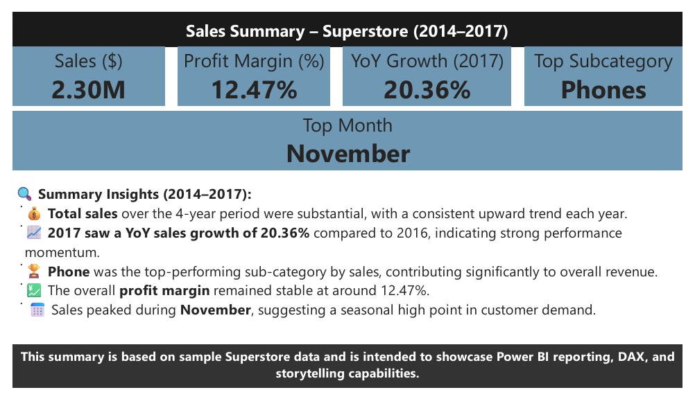

Sales Performance Dashboard | Power BI
Project Overview

This project is an interactive Sales Performance Dashboard built in Power BI to analyze business performance across multiple years. The dashboard is designed to help decision-makers quickly understand revenue trends, profitability, and top-performing segments using clear KPIs and visual storytelling.

The objective of this project was to transform raw sales data into actionable business insights using Power Query, data modeling, and DAX.

Dashboard Preview
Main Dashboard

Summary / Insights Page

Key Business Insights

Identified the top revenue-generating month using dynamic ranking logic.

Highlighted the highest performing product sub-category.

Analyzed overall sales, profit margin, and year-over-year growth trends.

Delivered a clean executive-level overview with interactive slicers for filtering.

Tools & Technologies

Power BI

Power Query (ETL)

DAX Measures

Data Modeling

Data Visualization & Storytelling

DAX Measures

Basic DAX measures were used to calculate KPIs such as:

Total Sales

Profit Margin

Year-over-Year Growth

These measures enable dynamic and interactive reporting across different filters and time periods.

Files in This Repository

sales-dashboard.pbix → Power BI working file

sales-dashboard.pdf → Exported report version

mainDashboard.png → Main dashboard screenshot

summary.png → Summary page screenshot

How to View

Download sales-dashboard.pbix to explore the dashboard in Power BI Desktop.

Open sales-dashboard.pdf for a quick report view.

Use the screenshots above for a quick preview without opening Power BI.

Learnings & Takeaways

Gained hands-on experience in building an end-to-end Power BI dashboard.

Improved understanding of business KPI design and storytelling.

Learned how to structure dashboards for executive decision-making.

Strengthened practical skills in data transformation and visualization.
